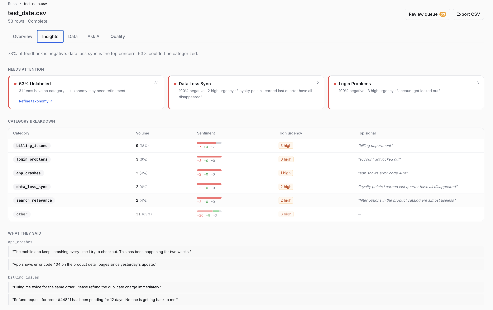
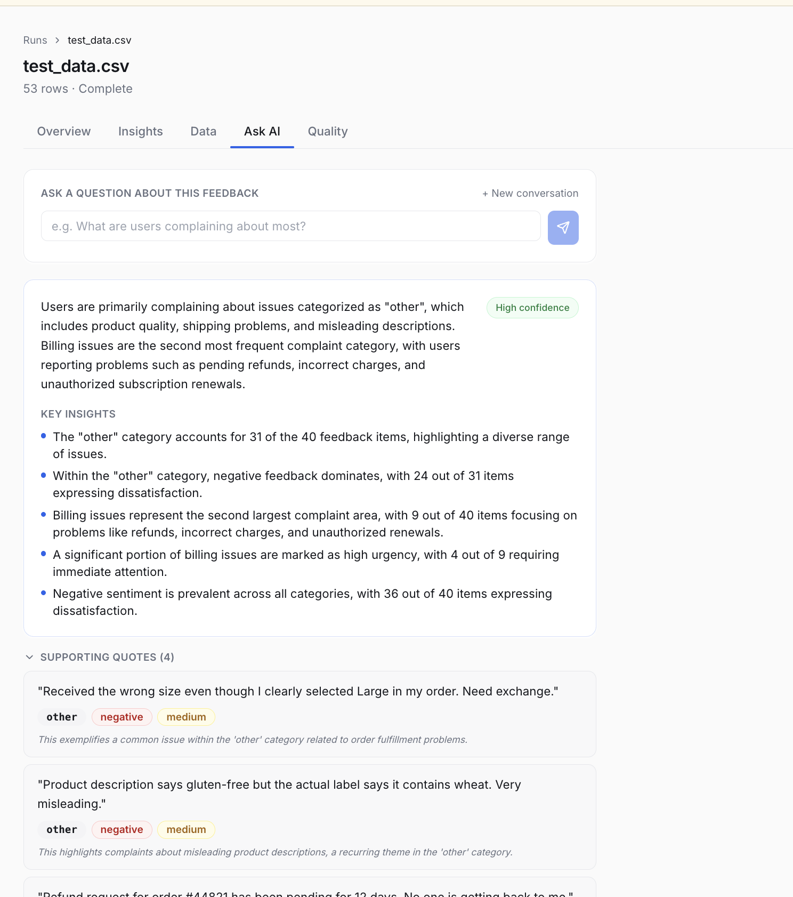
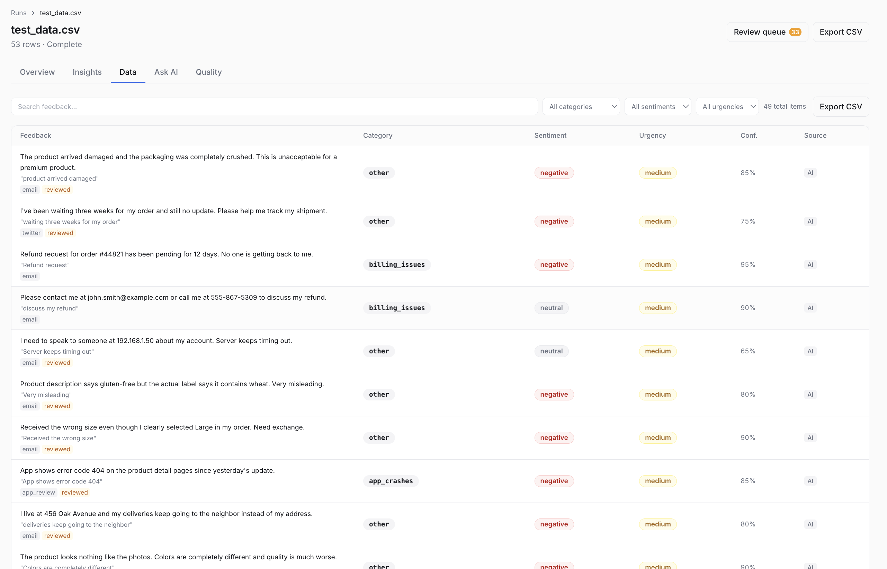
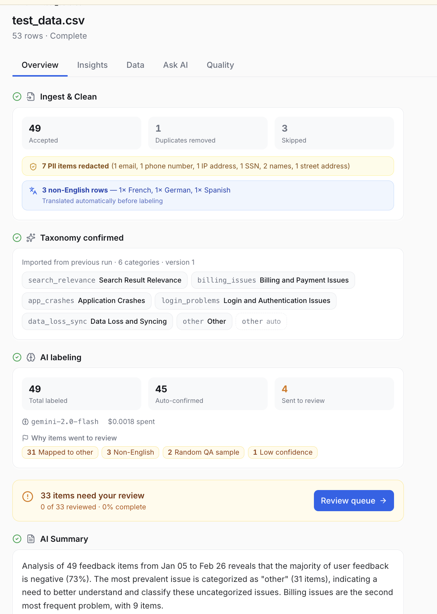

<div align="center">

<h1>🌾 GrainSift</h1>

**You're not analyzing feedback every week. You're generating a new opinion about it every week.**

GrainSift is an 8-stage pipeline that fixes that — structured labels, versioned taxonomy, confidence routing, and grounded AI queries. All running locally. No data leaves your machine.

[](https://python.org)
[](https://fastapi.tiangolo.com)
[](LICENSE)
[](#quick-start)
[](#configuration)

</div>

---



---

## The problem

Every week, a PM pastes customer feedback into ChatGPT. Gets a summary. Calls it analysis.

Next week — same data, different categories, different story. No way to compare. No audit trail. No idea if the model was confident or guessing. The themes shifted because the prompt shifted. Nobody noticed.

That's not a pipeline. That's a one-time opinion.

GrainSift is the engineered version. The LLM does exactly two things — propose categories once, and classify. Everything else is deterministic code. Same categories every week. Comparable numbers. Full audit trail.

---

## What it looks like

**Insights dashboard — attention signals derived automatically from your data**


**Ask AI — grounded answers with exact counts, no hallucinated numbers**



**Data view — every label auditable, confidence score visible, source tracked**



**Overview — full pipeline status, PII redaction log, taxonomy version**



---

## What makes it different

| | GrainSift | SaaS tools | Raw LLM prompts |
|--|--|--|--|
| Data stays local | ✅ | ❌ | Depends |
| PII redacted before storage | ✅ | ❌ | ❌ |
| Categories from your data | ✅ | ❌ (fixed schema) | ❌ (you write them) |
| Taxonomy versioned across runs | ✅ | ❌ | ❌ |
| Confidence-based review queue | ✅ | ❌ | ❌ |
| Corrections tracked separately | ✅ | ❌ | ❌ |
| Cross-run trend tracking | ✅ | Rarely | ❌ |
| Works with local models | ✅ Ollama | ❌ | Sometimes |

---

## Quick start

### Prerequisites

- Python 3.11+
- Node.js 18+
- [uv](https://docs.astral.sh/uv/getting-started/installation/) — `curl -LsSf https://astral.sh/uv/install.sh | sh`

### Install and run

```bash
# 1. Clone and install
git clone https://github.com/vish-cv/grainsift && cd grainsift
uv sync

# 2. Configure your LLM
cp .env.example .env
# Edit .env — set LLM_PROVIDER and add your API key

# 3. Start the backend
uv run grainsift start --reload

# 4. In a separate terminal, start the frontend
cd frontend && npm install && npm run dev
```

Open the URL shown in the frontend terminal and upload a CSV.

> **Tip:** `grainsift start --reload` watches for code changes automatically. For production use, drop `--reload`.

---

## How it works

```
┌──────────┐   ┌───────────┐   ┌────────────┐   ┌──────────┐   ┌──────────┐   ┌─────────┐   ┌─────────┐
│  Upload  │──▶│  Ingest   │──▶│  Discover  │──▶│  Label   │──▶│  Review  │──▶│  Query  │──▶│ Summary │
│  CSV     │   │ PII · Dedup│   │  Taxonomy  │   │  w/ LLM  │   │  Queue   │   │   AI    │   │   AI    │
└──────────┘   └───────────┘   └────────────┘   └──────────┘   └──────────┘   └─────────┘   └─────────┘
                   Stage 1          Stage 2         Stage 3       Stage 4-5      Stage 6-7     Stage 8
```

Every stage is auditable. Every decision is stored. Nothing is silently discarded.

---

## The engine

### Stage 1 — Ingest & clean

Raw text is cleaned and structured before any LLM sees it.

- **PII redaction** — detects and replaces email, phone, SSN, IP address, credit card, street address, and names with typed tokens (`[EMAIL]`, `[SSN]`) before writing to the database. The original text is never stored.
- **Deduplication** — SHA-256 content hash. No embedding model, no similarity threshold to tune.
- **Language detection** — flags non-English items for review. Non-English items are translated automatically before labeling.
- **Chunking** — splits items that exceed the token limit and re-merges them before labeling.

### Stage 2 — Taxonomy discovery

The LLM proposes categories from a sample of your actual data. You approve before anything is labeled.

```
Sample 250 items  →  LLM discovers categories  →  You review & edit  →  Lock version
```

- Every category must appear in at least 2 items
- Categories are versioned — extraction is always tied to the version you confirmed
- **Taxonomy inheritance** — reuse confirmed categories across runs with one click. No LLM call, no drift.
- **Pin & re-suggest** — pin specific categories and re-run discovery to fill the gaps around them.

### Stage 3 — AI labeling

Each item is classified in batches using [Instructor](https://github.com/instructor-ai/instructor) with a dynamically-built Pydantic schema. The `category` field is constrained to an enum of exactly your confirmed keys — **the model physically cannot produce an out-of-vocabulary label.**

Each label includes: `category · sentiment · urgency · key_phrase · confidence`

### Stage 4 — Validation routing

Every label is evaluated before it's confirmed. Items that fail routing rules go to the review queue instead of being auto-confirmed.

| Flag | Trigger | Always queued? |
|------|---------|---------------|
| `language_flag` | non-English detected | Yes |
| `schema_retry` | LLM failed schema validation | Yes |
| `high_urgency_low_confidence` | high urgency + confidence below threshold | Yes |
| `low_confidence` | confidence below threshold | If paired with another flag |
| `category_other` | item classified as "other" | Yes |
| `random_sample` | 5% random quality sample | Yes |

### Stage 5 — Human review queue

Flagged items surface in a priority queue sorted by urgency then confidence.

- **Confirm** — accept the LLM label as-is
- **Edit** — correct category and/or sentiment; creates a `Correction` record (original prediction preserved)
- **Skip** — return to the bottom of the queue
- **Bulk actions** — confirm all on page, or move a selection to a different category

Taxonomy changed after labeling? Items whose category no longer exists are automatically re-flagged.

### Stage 6 — Insights dashboard

Pure pandas. Zero LLM calls.

- Volume by category · sentiment breakdown · urgency distribution
- Attention cards auto-derived from the data — no config, no manual setup
- Key phrase clusters (top 5 per category)
- Daily time series with per-category breakdown
- Per-category model accuracy from human corrections
- Confusion matrix and confidence bucket accuracy
- One-click CSV export

### Stage 7 — Query engine

Ask plain-language questions about your labeled feedback. Every answer is grounded in actual counts.

```
Q: What are users complaining about most?
A: Order delivery issues (10 items, all negative) and product quality (9 items) are the
   top complaints. 73% of all feedback is negative. 24 of 49 items are high urgency.
   Confidence: high | Sources: 4 verbatim quotes

Q: Which of those are high urgency?
A: All 10 order delivery items are high urgency. 3 of 9 product quality items are high...
```

- No vector database. Retrieval uses keyword matching + urgency sampling.
- **Multi-turn** — last 5 exchanges from the same session included in each prompt.
- **Persistent** — all conversations saved to SQLite, survive page refreshes.

### Stage 8 — AI summary

One click. One LLM call. Cites specific numbers from the labeled data — volume by category, sentiment split, urgency distribution, and human review accuracy. Regenerable at any time.

---

## Projects

Group related runs under a project to track the same feedback source over time.

- **Shared taxonomy** — the first confirmed taxonomy becomes the default for all future runs in that project.
- **Per-project prompt overrides** — customize prompts per project without affecting global defaults.
- **Cross-run visibility** — all runs in one place with status, row counts, and flagged item counts.

---

## Prompt customization

All LLM prompts are editable without touching code. Three-level fallback:

```
Project override  →  Global default (Settings page)  →  Hardcoded constant
```

Editable prompts: `discovery_system`, `discovery_user`, `extraction_system`, `query_system`, `summary_system`, `summary_user`

---

## Configuration

```bash
# .env

# ─── LLM Provider ────────────────────────────────────────────────────────────
LLM_PROVIDER=anthropic          # anthropic | openai | gemini | ollama

# ─── API Keys (only set the one you use) ─────────────────────────────────────
ANTHROPIC_API_KEY=sk-ant-...
OPENAI_API_KEY=sk-...
GEMINI_API_KEY=AIza...

# ─── Model Selection ─────────────────────────────────────────────────────────
ANTHROPIC_MODEL=claude-sonnet-4-6        # or claude-haiku-4-5-20251001
OPENAI_MODEL=gpt-4o                      # or gpt-4o-mini
GEMINI_MODEL=gemini-2.0-flash            # or gemini-1.5-pro
OLLAMA_MODEL=llama3.2                    # or mistral | phi3
OLLAMA_BASE_URL=http://localhost:11434

# ─── Database ────────────────────────────────────────────────────────────────
DATABASE_URL=        # defaults to ~/.grainsift/grainsift.db

# ─── Processing ──────────────────────────────────────────────────────────────
BATCH_SIZE=5                  # items per LLM call (1–10)
CONFIDENCE_THRESHOLD=0.65     # below this → human review queue
MAX_FEEDBACK_WORDS=400        # items longer than this get chunked

# ─── Server ──────────────────────────────────────────────────────────────────
HOST=127.0.0.1
PORT=8000
DEBUG=false
```

---

## Stack

| Layer | |
|-------|---|
| Backend | Python 3.11+ · FastAPI · SQLAlchemy 2.x async |
| Database | SQLite with WAL mode · zero config · single file |
| LLM integration | Instructor · Anthropic · OpenAI · Gemini · Ollama |
| Frontend | React 18 · TypeScript · Vite · TanStack Query · Tailwind CSS v3 |
| PII detection | Regex-based · no external API · no data transmitted |
| Language detection | `langdetect` · runs locally |

---

## Project structure

```
grainsift/
├── engine/
│   ├── ingest.py            # Stage 1: PII, dedup, lang detect, chunking
│   ├── discovery.py         # Stage 2: taxonomy discovery + versioning
│   ├── extraction.py        # Stage 3: batch LLM labeling with Instructor
│   ├── validation.py        # Stage 4: routing rules (pure functions, no I/O)
│   ├── aggregation.py       # Stage 5+6: review queue + pandas stats
│   ├── calibration.py       # Stage 6: accuracy + confusion matrix
│   ├── query.py             # Stage 7: grounded Q&A with session persistence
│   ├── summarization.py     # Stage 8: AI executive summary
│   └── prompt_store.py      # 3-level prompt fallback (project → global → hardcoded)
├── api/routes/              # One FastAPI router per domain
│   ├── projects.py
│   ├── runs.py
│   ├── prompts.py
│   └── ...
├── llm/
│   ├── prompts.py           # All hardcoded prompt constants
│   └── providers/           # Anthropic / OpenAI / Gemini / Ollama adapters
└── models/
    ├── database.py          # SQLAlchemy ORM models
    ├── enums.py             # StrEnum for all categorical values
    └── schemas.py           # Pydantic v2 request/response schemas
```

---

## Contributing

Issues, PRs, and feedback welcome. If you're a PM who's been doing this manually — you're exactly who this is built for.

---

## License

MIT — see [LICENSE](LICENSE)
